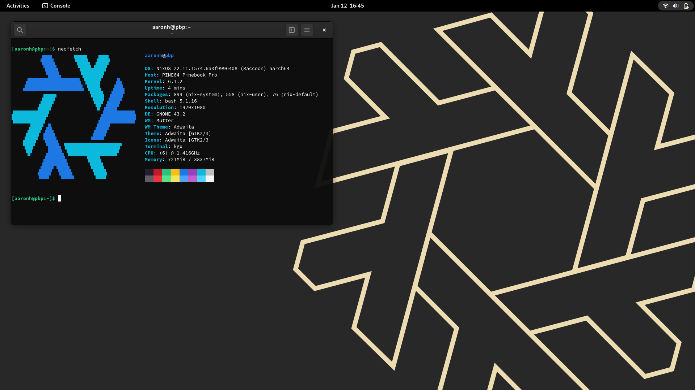

# nix-configs

This holds my .nix files for NixOS

## Main Nix files: (nix-configs)

These files are for the configuration, software that I use and unstable software that I use, note that some systems like the Pinebook Pro will use a custom configuration file.

- `flake.nix` : This is the main flake for system selection then that includes configuration, hardware-configuration (created during installation of NixOS), home-manager, disko and nixos-hardware (depending on the host)
- `configuration.nix` : This is the main file for the base system

## Home Manager file: (nix-configs/home.nix)

This file is for using with [Home Manager](https://nix-community.github.io/home-manager/index.html#sec-install-standalone).

- `home.nix` : This file is for settings for my user like Git name/email and other settings

## Partition Nix files: (nix-configs/partitions/)

These files are for the partition layouts that I use.

- `luks-btrfs-subvolumes.nix` : This is the main layout that I use for pretty much every system that I install NixOS on

## Desktop Nix files: (nix-configs/desktops/)

These files are for the desktops (DE or WM) that I use at times.

- `plasma.nix` : This file is for the desktop, login manager and other KDE applications
- `gnome.nix` : This file is for the desktop and login manager
- `pantheon.nix` : This file is for the desktop and login manager (this removes AppCenter)
- `sway.nix` : This file is for the Sway WM

## Hosts Nix files: (nix-configs/hosts/)

These files are for the systems themselves such as my Pinebook Pro, Raspberry Pi 4B or HP Omen.

**NOTE:** These are only really used to set the hostname, install the NVIDIA driver (like for thelio-nvidia) and such.

### x86_64 Nix files: (nix-configs/systems/x86_64/)

- `shepard` : This is my System76 nebula49.
- `garrus` : This is my System76 Galago Pro (galp3-b).
- `edi` : This is my custom build for homelab possible stuff.
- `thelio-nvidia` : This is my work Thelio B1.
- `sovereign` : This was a Linode instance but it could be for other VPS services as well.
- `harbinger` : This was a Linode instance but it could be for other VPS services as well.

### aarch64 Nix files: (nix-configs/systems/aarch64/)

- `jaal.nix` : This is my Pinebook Pro.
- `peebee.nix` : This is my PinePhone.
- `lexi.nix` : This is my OnePlus 6T.
- `vetra.nix` : This is my Raspberry Pi 4B.

## Web Nix files: (nix-configs/web/)

These files are for websites such as LAMP and NGINX.

- `lamp.nix` : This file is a WIP for LAMP setup. 
- `ahoneybun-net.nix` : This file is a basic setup for my website (ahoneybun.net).
- `hydra-ahoneybun-net.nix` : This file is a NGINX reverse proxy for my [Hydra](https://github.com/NixOS/hydra) server pointing to the localhost.
- `cloud-ahoneybun-net.nix` : This file is for Nextcloud.
- `rockymtnlug-org.nix` : This file is for [RMLUG](https://rockymountainlinuxfest.org).
- `tildecafe-com.nix` : This file is for [Tildecafe](https://tildecafe.com).
- `stoners-space.nix` : This file is for Mastodon on my stoners.space domain, simple changes can be made for a different domain.
- `nginx-owncast.nix` : This file is a NGINX reverse proxy for [Owncast](https://owncast.online) though it is not currently working.

### Screenshots

