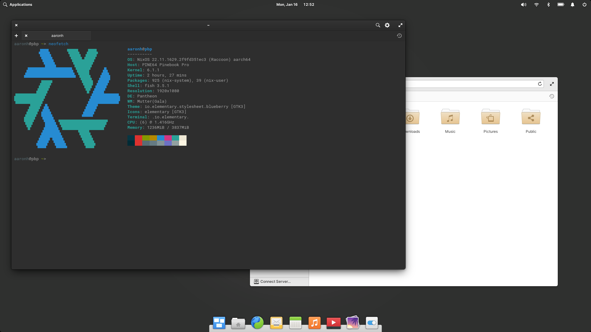

# nix-configs

This holds my .nix files for NixOS

## Main Nix files: (nix-configs)

These files are for the configuration, software that I use and unstable software that I use, note that some systems like the Pinebook Pro will use a custom configuration file.

- `configuration.nix` : This is the main file for the base system including some applications that I use
- `programs.nix` : This file adds applications like Slack, Discord and virt-manager including turning on the services
- `unstable.nix` : This file has the applications that need to be from unstable to work like ProtonVPN software

## Desktop Nix files: (nix-configs/desktops)

These files are for the desktops (DE or WM) that I use at times.

- `plasma.nix` : This file is for the desktop, login manager and other KDE applications
- `gnome.nix` : This file is for the desktop and login manager
- `pantheon.nix` : This file is for the desktop and login manager (this removes AppCenter)

## System Nix files: (nix-configs/systems)

These files are for the systems themselves such as my Pinebook Pro, Raspberry Pi 4B or HP Omen.

### Use the nixos-hardware channel for Pinebook Pro and Raspberry Pi 4:

```
sudo nix-channel --add https://github.com/NixOS/nixos-hardware/archive/master.tar.gz nixos-hardware
sudo nix-channel --update
```

- `hp-omen.nix` : This file is mainly for my HP Omen to add and enable the NVIDIA driver from stable
- `linode.nix` : This file is for a Linode instance though it might work for other server setups
- `oryp6.nix` : This file is mainly for my System76 Oryx Pro (oryp6) to add and enable the NVIDIA driver from stable
- `rpi4.nix` : This file is to configure a Raspberry Pi 4B
- `pinebook-pro.nix` : This file is to configure a PineBook Pro
- `pinephone.nix` : This file is to configure a PinePhone

## Development Nix files: (nix-configs/dev)

These files are for development such as Apache.

- `lamp.nix` : This file is a WIP for LAMP setup. 

### Screenshots



